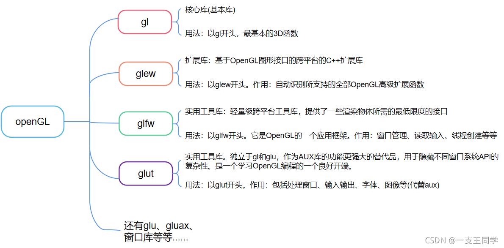

# OpenGL

## 结构图




## 创建窗口
因为OpenGL只是一个标准/规范，具体的实现是由驱动开发商针对特定显卡实现的。由于OpenGL驱动版本众多，它大多数函数的位置都无法在编译时确定下来，需要在运行时查询。所以任务就落在了开发者身上，开发者需要在运行时获取函数地址并将其保存在一个函数指针中供以后使用。取得地址的方法因平台而异，在Windows上会是类似这样：
```cpp
// 定义函数原型
typedef void (*GL_GENBUFFERS) (GLsizei, GLuint*);
// 找到正确的函数并赋值给函数指针
GL_GENBUFFERS glGenBuffers  = (GL_GENBUFFERS)wglGetProcAddress("glGenBuffers");
// 现在函数可以被正常调用了
GLuint buffer;
glGenBuffers(1, &buffer);
```
你可以看到代码非常复杂，而且很繁琐，我们需要对每个可能使用的函数都要重复这个过程。幸运的是，有些库能简化此过程，其中GLAD是目前最新，也是最流行的库。


接下来创建main函数，在这个函数中我们将会实例化GLFW窗口：
```cpp
int main()
{
    glfwInit();
    glfwWindowHint(GLFW_CONTEXT_VERSION_MAJOR, 3);
    glfwWindowHint(GLFW_CONTEXT_VERSION_MINOR, 3);
    glfwWindowHint(GLFW_OPENGL_PROFILE, GLFW_OPENGL_CORE_PROFILE);
    //glfwWindowHint(GLFW_OPENGL_FORWARD_COMPAT, GL_TRUE);  // Mac 平台

    return 0;
}
```
首先，我们在main函数中调用glfwInit函数来初始化GLFW，然后我们可以使用glfwWindowHint函数来配置GLFW。glfwWindowHint函数的第一个参数代表选项的名称，我们可以从很多以GLFW_开头的枚举值中选择；第二个参数接受一个整型，用来设置这个选项的值。


我们需要告诉GLFW我们要使用的OpenGL版本是3.3，这样GLFW会在创建OpenGL上下文时做出适当的调整。这也可以确保用户在没有适当的OpenGL版本支持的情况下无法运行。我们将主版本号(Major)和次版本号(Minor)都设为3。我们同样明确告诉GLFW我们使用的是核心模式(Core-profile)。明确告诉GLFW我们需要使用核心模式意味着我们只能使用OpenGL功能的一个子集（没有我们已不再需要的向后兼容特性）。如果使用的是Mac OS X系统，你还需要加下面这行代码到你的初始化代码中这些配置才能起作用（将上面的代码解除注释）


接下来我们创建一个窗口对象，这个窗口对象存放了所有和窗口相关的数据，而且会被GLFW的其他函数频繁地用到。
```cpp

GLFWwindow* window = glfwCreateWindow(800, 600, "LearnOpenGL", NULL, NULL);
if (window == NULL)
{
    std::cout << "Failed to create GLFW window" << std::endl;
    glfwTerminate();
    return -1;
}
glfwMakeContextCurrent(window);

```

glfwCreateWindow函数需要窗口的宽和高作为它的前两个参数。第三个参数表示这个窗口的名称（标题），这里我们使用"LearnOpenGL"，当然你也可以使用你喜欢的名称。最后两个参数我们暂时忽略。这个函数将会返回一个GLFWwindow对象，我们会在其它的GLFW操作中使用到。创建完窗口我们就可以通知GLFW将我们窗口的上下文设置为当前线程的主上下文了。

在之前已经提到过，GLAD是用来管理OpenGL的函数指针的，所以在调用任何OpenGL的函数之前我们需要初始化GLAD。
```cpp
if (!gladLoadGLLoader((GLADloadproc)glfwGetProcAddress))
{
    std::cout << "Failed to initialize GLAD" << std::endl;
    return -1;
}
```
我们给GLAD传入了用来加载系统相关的OpenGL函数指针地址的函数。GLFW给我们的是glfwGetProcAddress，它根据我们编译的系统定义了正确的函数。
nnklkkl;'


